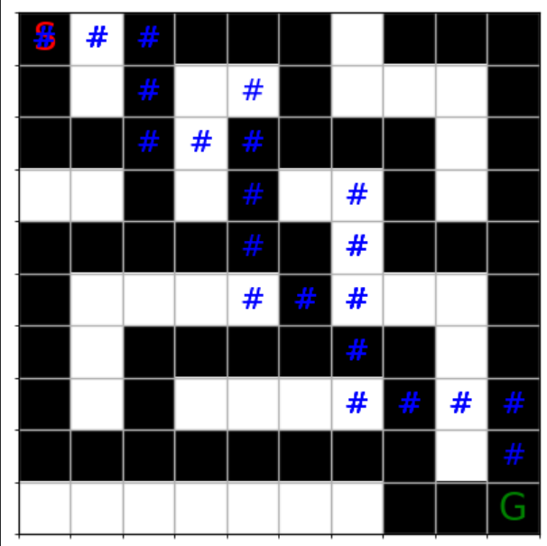

This is a Q-Learning project where an AI agent learns to move through a maze from a start point to a goal.

The maze is a grid with free cells and walls

The agent can move up, down, left, or right

It gets rewards for reaching the goal and penalties for hitting walls or taking extra steps

Over many episodes, the agent learns the best path using trial and error

